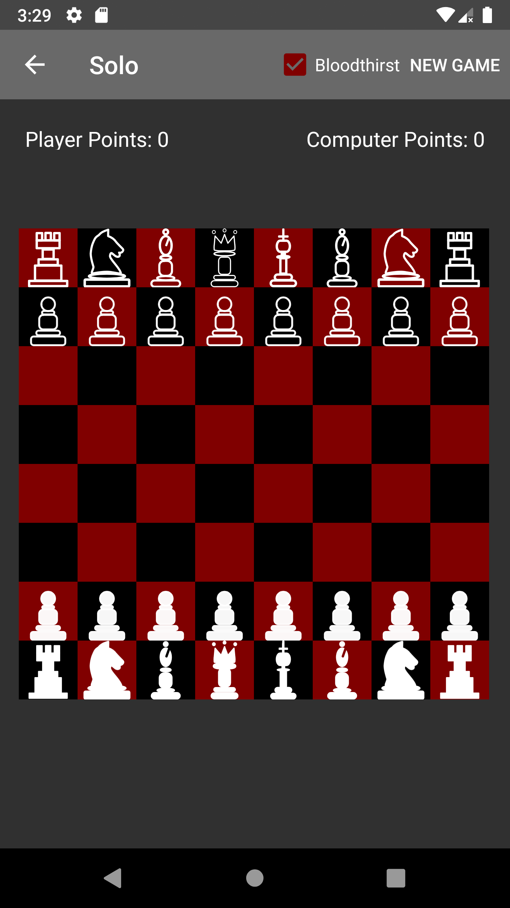
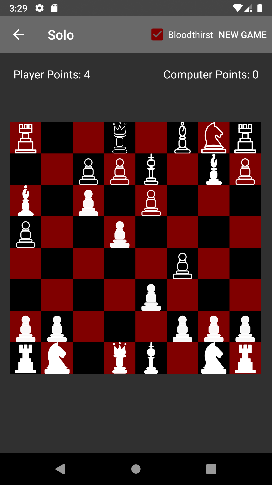

# open-chaos-chess

## About
Open Chaos Chess is a free and open source version of [Chaos Chess](https://play.google.com/store/apps/details?id=dev.corruptedark.chaoschess), stripped of Google Play Services. Chaos Chess is a variation of chess where you can pick the piece that moves, but the moves are random. As such, you no longer win by checkmates. Instead, you win by eliminating your opponent's pieces. Have fun, and may the RNG be ever in your favor.

All future development for Chaos Chess will be in this project.

### Permissions
`ACCESS_FINE_LOCATION` is only used as a mandatory prerequisite for Bluetooth functionality. No location data is stored or sent anywhere by this application.

`READ_EXTERNAL_STORAGE` and `WRITE_EXTERNAL_STORAGE` are only used for import/export of color preferences and achievements.

## Current Status
As of the most recent commit to the master branch, achievements and single player games are working. However, since it is not using any online services, the progress is only saved locally and is lost if app data is wiped or if a player installs on a new device. Multiplayer is now working over Bluetooth for the most part. Pieces are now animated on move. Bloodthirst feature has been implemented. While Bloodthirst is active, pieces will always attack if possible.

----

## Screenshots

----

## Direct Contributors

[CorruptedArk](https://github.com/CorruptedArk) - Original Author

[egorguslyan](https://github.com/egorguslyan) - Added Chess960 mode, Queens Attack Handicap, Smart Computer mode, plus other small improvements to logic of building and drawing the board

[LibreHacker](https://github.com/LibreHacker) - Russian Translations

[Lian C. Begett/RedsickleDE](https://github.com/RedsickleDE) - German Translations

[berkaygunduzz](https://github.com/berkaygunduzz) - Turkish Translations

[Vulldozer](https://github.com/Vulldozer) - Arabic Translations and suggested a quality of life improvement on capturing pieces

[sguinetti](https://github.com/sguinetti) - Spanish Translations

[czarkoff](https://github.com/czarkoff) - Suggested idea for feature: Bloodthirst

[itsanogo](https://github.com/itsanogo) - Suggested Bloodthirst by default toggle

[Gitoffthelawn](https://github.com/Gitoffthelawn) - Suggested explanation of location permissions

[vi](https://github.com/vi) - Suggested a mode with more aggressive computers as well as a player handicap mode

If you want to contribute, please read [CONTRIBUTING](CONTRIBUTING.md).

----

## External Library Credits

Android Material Color Picker Dialog is used for picking colors.

Android Material Color Picker Dialog https://github.com/Pes8/android-material-color-picker-dialog Copyright © 2017 Simone Pessotto Licensed under The MIT License (MIT)
